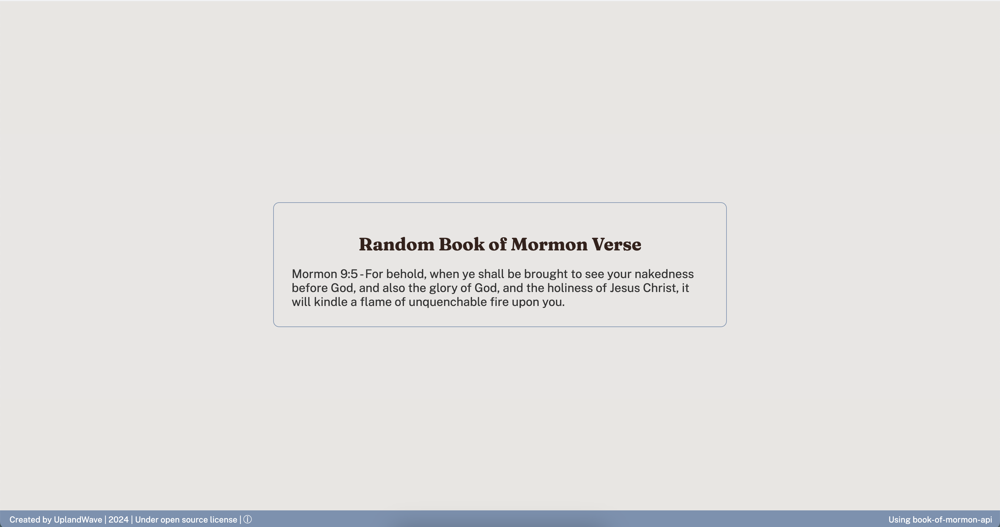

# BOM-Day

## Overview
**BOM-Day** is a simple and elegant website that displays a new and random verse from the Book of Mormon.

## Link
[BOM Day](https://uplandwave.github.io/BOM-Day/)

## Intended Use
Created to serve as a new default home screen for new browser tabs or windows. It provides a quick reminder to read the word of God as often as possible.

## Features
- **Random Verse:** Each refresh pulls a new and random verse from the Book of Mormon.
- **Inspirational:** Helps maintain a daily habit of reading scripture.
- **Minimalistic Design:** Clean and distraction-free interface.

## License
This project is licensed under the EDUCATIONAL/DEMONSTRATION USE LICENSE - see the [LICENSE](./LICENSE.txt) file for details.

---

Working on an app with a widget.

---
